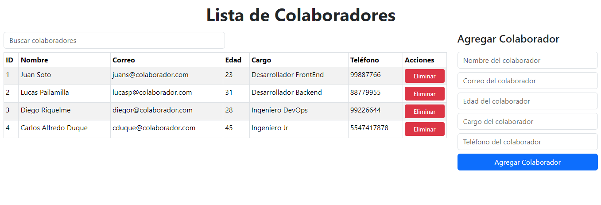

# Módulo 4 REACT I - Desafío 3 - Base de Datos Colaboradores - React + Vite

## Presentación Página Web

##  

 

## Descripción del PY ⌨️

El proyecto presentavo valida nuestros conocimientos de el uso de estados con React con el hook useState y además se utilizan funciones de estructuración para mostrar ordenadamente la información requerida.
Se realizaron validaciones, las mencionadas en el requerimiento y algunas extras para demostrar mas "consistencia" y cercanía con lo real.
Adicional se utiliza el hook useEffect y la propiedad localStorage, para lograr así mantener la información persistente en la tabla de colaboradores.

## Tecnologías Usadas 🛠️

- **HTML** 💀
- **CSS** 🎆
- **JS** 🧑‍💻
- **REACT JS** 👌
- **React-Bootstrap** 📚

 

---

 

## Autores 👨‍💻

**Desarrolladores FullStack G-60 - Daniel Hernández T. y Luis Fernando Sanchez F.⚡**

Sígueme en mis redes sociales: 
 
